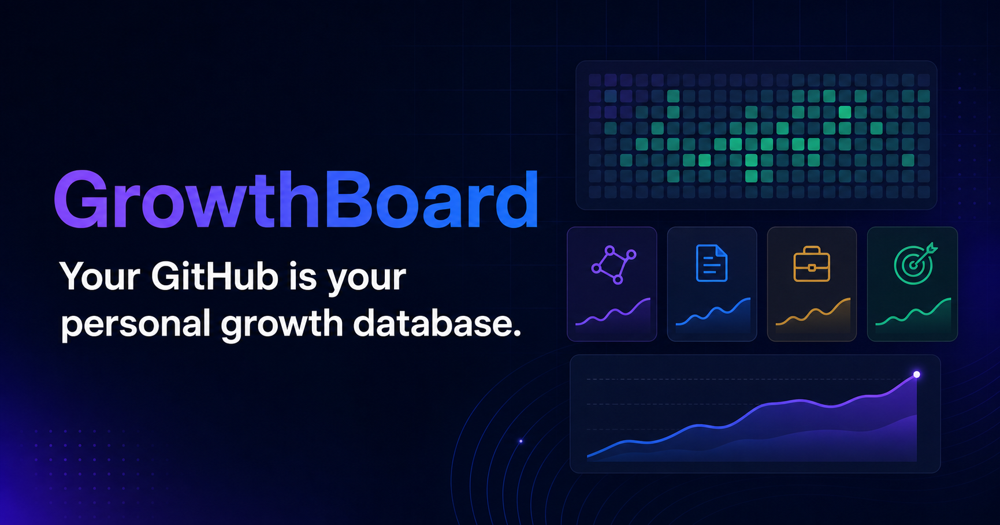
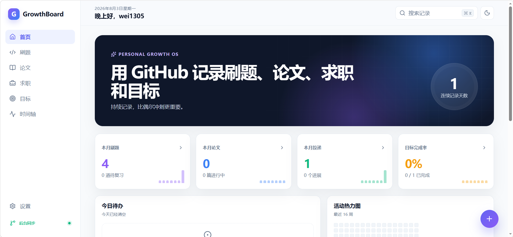

<p align="center">
  <a href="./README_EN.md">English</a> | <strong>简体中文</strong>
</p>

# GrowthBoard 个人学习成长记录网站 无需服务器 仅在github运行



> Your GitHub is your personal growth database.

一个由 GitHub 提供后台持久化、但所有日常操作都在网站内完成的个人成长记录系统。添加、编辑、归档、恢复和删除不会跳转到 GitHub，提交成功后页面会立即更新。支持手机、平板等多种设备。

[在线网站](https://wei1305.github.io/growth-board/) · [运行记录](https://github.com/wei1305/growth-board/actions)

## 演示视频

[](https://wei1305.github.io/growth-board/demo/)

[▶ 打开视频播放页（MP4，约 7.1 MB）](https://wei1305.github.io/growth-board/demo/) · [直接打开 MP4](https://wei1305.github.io/growth-board/demo/growth-board-demo.mp4) · [仓库内视频文件](./public/demo/growth-board-demo.mp4)

> [!IMPORTANT]
> **仓库要求：GrowthBoard 当前仅支持 Public 仓库。** 网站部署依赖 GitHub Pages；为保证 GitHub Free 用户可以直接启用并保持统一的部署流程，请不要将使用本项目的仓库设为 Private。

## 特点

- 单仓库：源代码、配置、Issues、Actions 和 Pages 全部在一个仓库内
- GitHub-only：无服务器、无外部数据库、无需本地电脑持续运行
- 四类记录：刷题、论文、求职、目标；含仪表盘、统计图和统一时间轴
- 模块可选：刷题、论文、求职、目标均可全局启用/关闭，访问者也可在本设备隐藏模块
- 站内操作：新增、编辑、归档、恢复和删除均使用网站内弹窗，不打开 Issue 页面
- 即时回显：GitHub API 保存成功后立即更新界面，并跨刷新保留到后台部署完成
- 响应式：桌面、平板和 375px 手机均可使用，支持深色模式
- 最小权限：只需要绑定单仓库、仅含 Issues 读写权限的细粒度访问令牌
- Public-only：当前安装和部署流程只支持 Public 仓库，并依赖 GitHub Pages 提供网站访问

## 工作原理

```text
网站内表单
    ├─ GitHub REST API → GitHub Issues（后台持久化）
    └─ 立即更新当前页面 + 保存待确认记录
                           ↓
             GitHub Actions 自动重建
                           ↓
                  public/data/*.json
                           ↓
                     GitHub Pages
```

GitHub Issues 仍然是跨设备的权威数据源，但不再充当前台操作界面。网站写入成功后先即时回显；Actions 生成的新数据发布后，临时待确认状态会自动消失。

### 单用户编辑保护

每个仓库实例只允许该仓库的所有者账号编辑记录。网站连接令牌时会同时验证当前 GitHub 登录账号和仓库所有者；新增、修改、归档、恢复及删除前也会重新校验。数据导出器只接收仓库所有者创建的记录，因此其他账号即使绕过网页直接提交带记录标签的 Issue，也不会进入网站数据。

这个规则和首页问候语都会根据 `repository` 的 `owner/name` 自动生效。其他用户从模板创建自己的仓库并修改 `config/site.json` 中的 `repository` 后，首页会显示该仓库所有者的账号名，并且只允许该账号编辑，无需另外配置名字或白名单。

GitHub Pages 是静态网站，无法安全地内置仓库写入凭证。因此每个需要写入的浏览器必须在网站「设置」中配置自己的细粒度访问令牌。令牌只进入该浏览器的 `localStorage`（勾选“记住”）或 `sessionStorage`，不会写进源码、Issue、Actions 日志或构建文件。

## 首次启用

仓库已包含完整工作流。首次使用只需：

1. 打开 **Actions → Initialize GrowthBoard labels → Run workflow**，创建所需标签。
2. 打开 **Settings → Pages → Build and deployment**，确认 Source 为 **GitHub Actions**。
3. 打开 **Actions → Build and deploy GrowthBoard → Run workflow**。
4. 创建 GitHub **Fine-grained personal access token**：
   - Repository access 只选择当前仓库；
   - Repository permissions 只把 **Issues** 设置为 **Read and write**；
   - 设置合理的过期时间，不授予 Contents、Actions 或 Administration 权限。
5. 打开网站「设置」，把令牌粘贴到「连接后台同步」并验证。
6. 此后点击右下角 `+` 或模块页「添加记录」，全程不再离开网站。
7. 等待首次部署完成，访问 `https://你的用户名.github.io/仓库名/`。

本仓库的默认地址是 <https://wei1305.github.io/growth-board/>。

> GitHub 会自动授予令牌 Metadata 只读权限，这是访问仓库 API 所需的基础权限，不需要额外扩大权限范围。

## 模块开关

全局开关位于 [`config/site.json`](./config/site.json)：

```json
{
  "modules": {
    "leetcode": true,
    "papers": true,
    "jobs": true,
    "goals": true
  }
}
```

将某项改为 `false` 并提交后，该模块会从侧边栏、移动导航、首页统计、全局搜索、快速添加和时间轴中消失；数据导出也会跳过该模块。重新设为 `true` 后，下一次构建会再次从 Issues 读取其数据。

访问者还可在网站的「设置」页隐藏模块。这个偏好只保存在当前浏览器，不会修改仓库配置。

## 站点配置

仍在 [`config/site.json`](./config/site.json) 中修改：

| 字段 | 作用 |
|---|---|
| `siteName` | 网站名称 |
| `tagline` | 首页副标题 |
| `repository` | 必须是 `owner/repository` 格式 |
| `locale` | 日期本地化语言，例如 `zh-CN` |
| `theme` | `light`、`dark` 或 `system` |
| `modules` | 四个模块的全局开关 |
| `profile` | 首页主标题和介绍 |

如果你复制了仓库，请至少修改 `repository` 和 `profile`。首页问候语会自动使用 `repository` 中的仓库所有者账号名。

## 添加和维护记录

网站内提供四类结构化表单：

- 刷题：题目、难度、语言、算法标签、掌握度和复习日期
- 论文：论文、Venue、研究方向、阅读进度、评分和总结
- 求职：公司代号、岗位、阶段和下一步日期
- 目标：周期、目标值、当前值、截止日期和复盘

记录卡片、求职看板、目标列表、搜索结果和时间轴都可以直接打开站内编辑器。编辑器支持：

- 保存修改：更新后台记录并立即刷新页面
- 归档/恢复：切换记录状态，不离开网站
- 删除：添加后台排除标记并立即从网站隐藏；需要二次确认

Issue Forms 仍保留为兼容和应急入口，但正常使用无需打开它们。

> [!WARNING]
> 这是公开单仓库模式。虽然网站隐藏了 Issue 操作界面，但后台 Issue 仍然公开可见。求职记录中不要填写手机号、私人邮箱、身份证、住址、薪资详情、未公开 Offer、面试官评价或公司保密材料。

## 自动化工作流

- `build-and-deploy.yml`：读取 Issues、运行测试、构建前端并部署 Pages
- `initialize.yml`：初始化类型、状态、难度和控制标签
- `validate.yml`：在 Pull Request 中运行类型检查、Python 测试和生产构建

数据导出器会自动分页读取所有 Issues，排除 Pull Requests，容忍可选空字段，并把无效记录写入 `invalid-records.json`，避免单条错误记录阻塞整个网站。

## 本地开发

需要 Node.js 22.13+ 和 Python 3.11+：

```bash
npm ci
npm run dev
```

常用检查：

```bash
npm test
npm run build
```

本地默认使用 `public/data/` 中的演示数据。要用 GitHub Issues 生成数据：

```bash
GITHUB_REPOSITORY=owner/repository GITHUB_TOKEN=your_token python scripts/export_data.py
```

不要把 Token 写入源码、`VITE_*` 环境变量、Issue 或提交记录。网站设置中的令牌只保存在当前浏览器；公共电脑建议取消“记住在当前浏览器”，使用完毕后点击「断开连接」。

页面通过 Content Security Policy 只允许连接自身资源和 `api.github.com`，并且不加载第三方脚本。仍应坚持使用仓库级、最小权限、可过期的令牌。

## 目录

```text
growth-board/
├─ .github/
│  ├─ ISSUE_TEMPLATE/       # 兼容和应急录入表单
│  └─ workflows/            # 初始化、验证和 Pages 部署
├─ config/site.json         # 网站与模块开关
├─ public/data/             # 构建数据和演示数据
├─ scripts/
│  ├─ export_data.py        # Issues → JSON
│  └─ tests/                # 导出器测试
├─ src/                     # React 网站、站内表单和同步客户端
├─ tests/                   # 配置和数据契约测试
└─ README.md
```

## 验收范围

- 375px 宽度无横向页面滚动
- 深浅主题、搜索、筛选、移动导航和模块开关可用
- 站内新增、编辑、归档、恢复和删除不会跳转到 GitHub
- API 保存成功后当前页面立即更新，刷新时待确认记录不会消失
- Issue 变化仍会触发自动数据导出和 Pages 部署
- 无效 Issue 不影响其他记录
- 构建产物不包含 Token
- 至少支持 1000 条记录（GitHub API 分页，每页 100 条）

## License

本项目采用 [MIT License + Commons Clause](./LICENSE) 的源码公开许可。

- 允许个人、教育和商业环境使用、复制、修改与分发本项目
- 允许将本项目作为组件用于具有实质新增价值的产品
- 禁止原封不动、仅换名称/品牌，或只做非实质修改后收费出售本项目
- 如需销售 GrowthBoard 本身或提供本质上等同于 GrowthBoard 的收费服务，须事先获得仓库所有者的商业授权

由于该许可包含销售限制，本项目属于 **source-available（源码公开）** 软件，而不是 OSI 定义的开源软件。此前已经按照 MIT License 发布的历史版本仍适用其原许可证。
